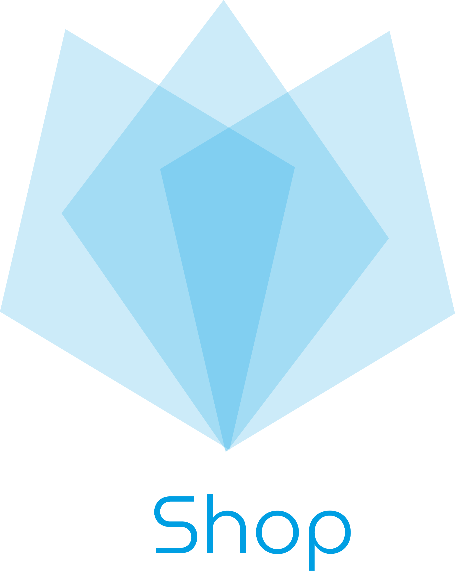

<!DOCTYPE html>
<html lang="en">

<head>
  <meta charset="UTF-8">
  <meta name="viewport" content="width=device-width, initial-scale=1.0">
  <link rel="stylesheet" href="style.css">
  <link rel="stylesheet" href="https://stackpath.bootstrapcdn.com/bootstrap/4.5.0/css/bootstrap.min.css"
    integrity="sha384-9aIt2nRpC12Uk9gS9baDl411NQApFmC26EwAOH8WgZl5MYYxFfc+NcPb1dKGj7Sk" crossorigin="anonymous">
</head>

<body>
  <h2 align="center">BIO 👋</h2>
  

      Computer Engineering student and Member of
      <a href="https://github.com/TawsEspol">Taws ESPOL</a> and CERN summer
      student at 2022
    

  

      I'm used to learn new technologies by my own account from frameworks I
      use. I try to keep up with the trends and take advantage of their
      capabilities.
    

   
  <h2 align="center">Projects</h2>

  

      Here are some of the projects I've worked on in order to improve my
      skills.
    

  <table align="center">
      <thead>
        <tr>
          <th class="center-t" align="center">Budgetfy Mobile</th>
          <th class="center-t" align="center">Mi Horario Web</th>
          <th class="center-t" align="center">UShop</th>
        </tr>
      </thead>
      <tbody>
        <tr>
          <td align="center">
            
          </td>
          <td align="center">
            
          </td>
          <td align="center">
            
          </td>
        </tr>
      </tbody>
    </table>
   
  <h2 align="center">Skills</h2>
  
A summary of my programming skills.

  

    <!-- 
    
    
      
    
     -->
    
    
    
    
    
    
    
    
    
    
    
    
    
    
  

   
  <h2 align="center">Pinned Repositories</h2>
  
Take a look at my most outstanding repositories.

</body>
</html>
